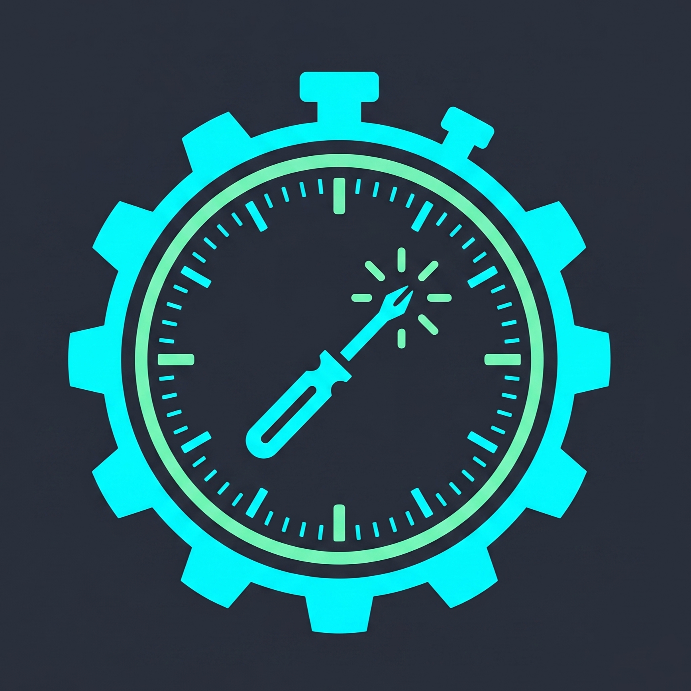
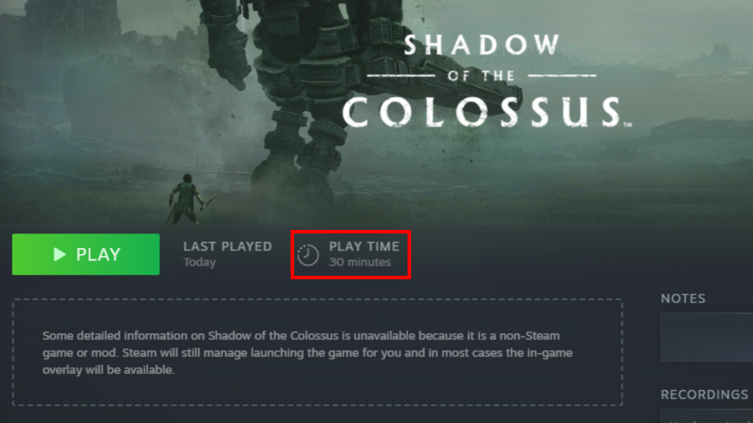
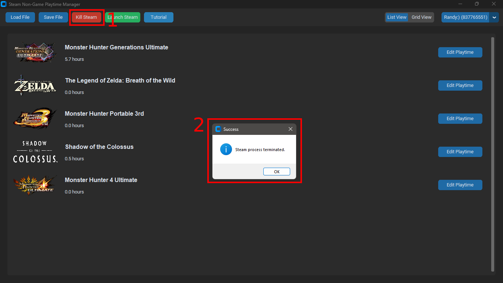
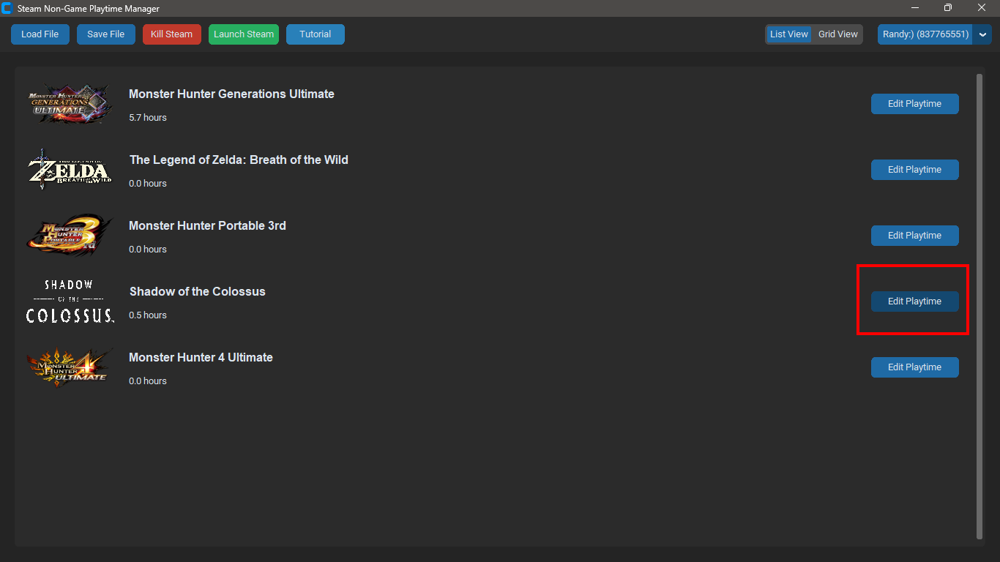
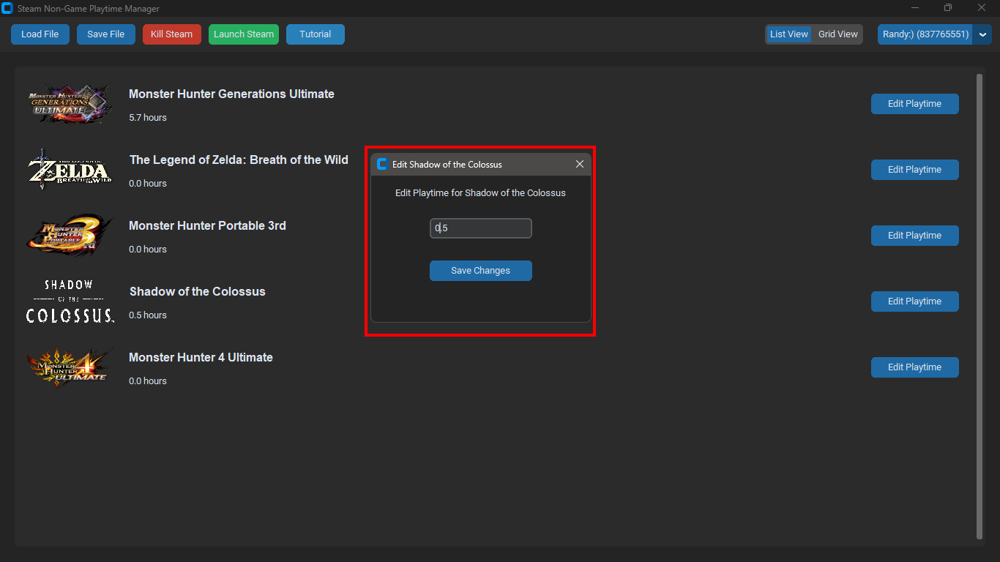
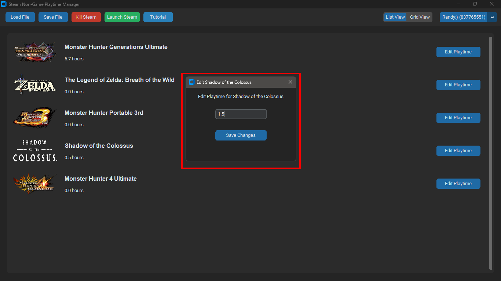
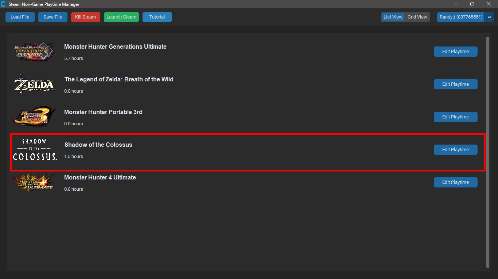
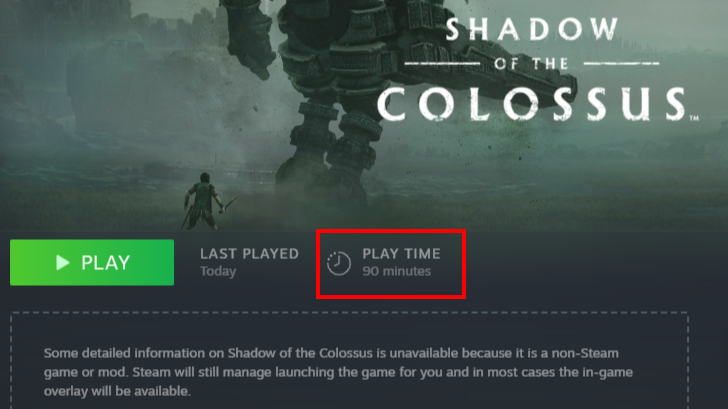

  
  <h1>NonSteamTime: Steam Non-Game Playtime Manager</h1>
  
An open-source graphical tool to easily manage, edit, and modify the recorded playtime hours for custom Non-Steam games added to your Steam Library.

  

    <a href="https://github.com/Randyh-25/NonSteamTime/releases"><strong>Download Latest Release (.exe)</strong></a> ·
    <a href="https://github.com/Randyh-25/NonSteamTime/issues">Report Bug</a>
  

---

## Features
* **Edit Playtime Instantly:** Change the hours played for any Non-Steam shortcut.
* **Bypass File Locks:** Built-in tool to safely terminate Steam processes and unlock `localconfig.vdf`.
* **Artwork Support:** Automatically loads custom Steam Grid artwork (`p.png`) and logos.
* **Precise Modification:** Handles Steam's AppID conversion perfectly to ensure data is saved to the correct game.

---

## How to Change Playtime for Non-Steam Games

**Before Editing:**
*(Example: The game currently has 30 minutes of playtime in the Steam Library)*

Follow these simple steps to edit your custom game hours:

### Step 1: Kill the Steam Process
Before making any changes to your Steam data, the Steam client must be completely closed.
1. Open the **Steam Non-Game Playtime Manager** app.
2. Click the red **"Kill Steam"** button at the top menu.
3. Wait for the confirmation message saying the process is terminated.

### Step 2: Edit and Save Your Playtime
1. Find the custom shortcut or game you want to modify in the list.
2. Click the **"Edit Playtime"** button.

3. Enter your desired hours. You can use decimals (e.g., typing `0.5` for 30 minutes, or `1.5` for 90 minutes). 
4. Click **"Save Changes"**.

5. The app will automatically save this new data to your local Steam config file, and your list will reflect the new hours.

### Step 3: Launch Steam & Verify
1. Click the green **"Launch Steam"** button in the app (or open Steam normally from your desktop).
2. Navigate to your **Steam Library** and click on the Non-Steam game you just edited.
3. Check the playtime counter. It should now successfully display your new custom hours!

---

## FAQ & Troubleshooting

**Q: Why does Steam reset or overwrite my edited playtime when I launch it?**  
**A:** This sometimes happens due to Steam's aggressive Cloud Sync. Steam might think your local configuration file is out of sync and overwrites it with the old data from their servers. If the standard steps above don't work for you, try this manual **Offline Method workaround**:

1. Kill the Steam process using the app.
2. Edit and save your new playtime.
3. **Crucial Step:** Temporarily turn off your Wi-Fi or unplug your Ethernet cable from your PC.
4. Launch Steam. Since there is no internet connection, click **"Start in Offline Mode"**.
5. Check your Library to ensure the new playtime is loaded correctly.
6. Reconnect your internet, click "Steam" in the top-left corner of the Steam window, and select **"Go Online..."** to permanently sync the new data to the Steam Cloud.
